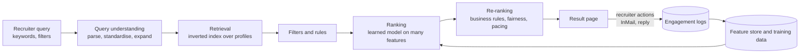
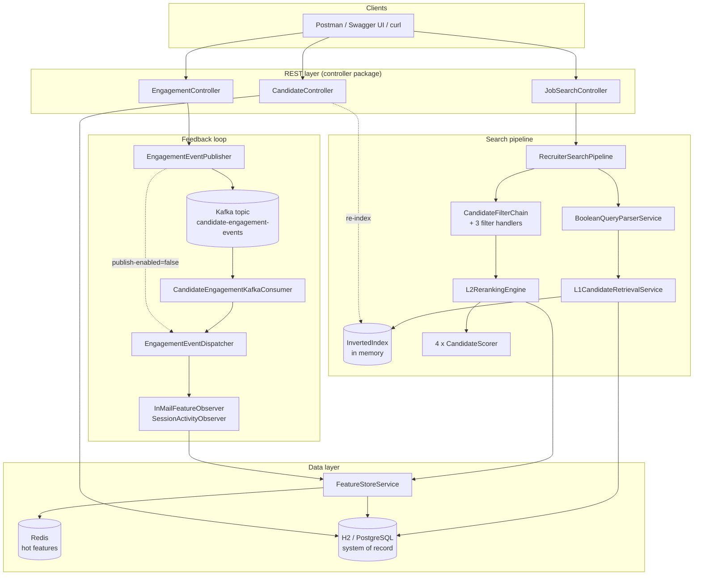
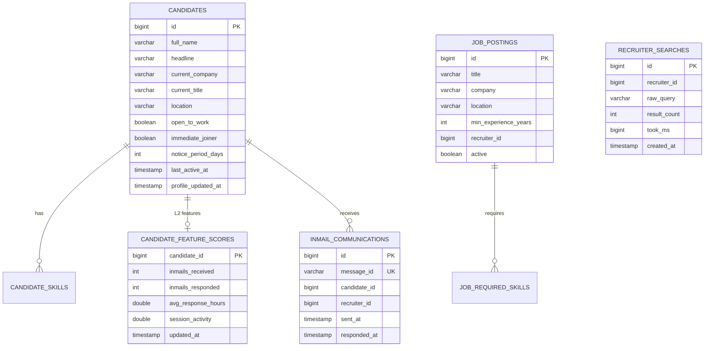
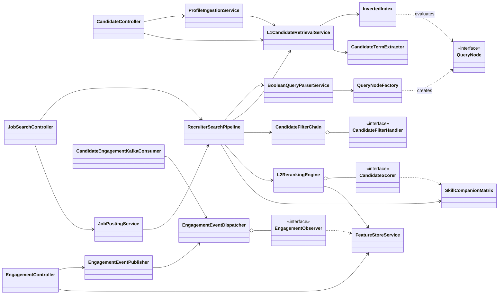
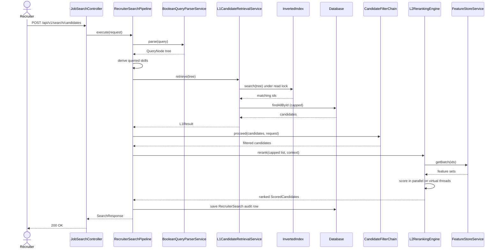
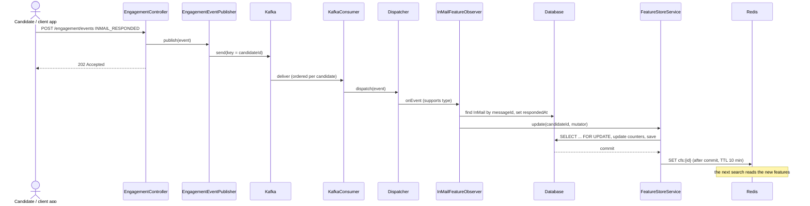

# LinkedIn-Style Job Search & Recruiter Candidate Matching Engine

A Spring Boot 3 reference implementation of a **two-stage (L1 retrieval -> L2 reranking) talent search engine** inspired by the publicly described architecture of LinkedIn Recruiter. A recruiter types a Boolean query such as

```
"JPMorgan" AND ("Talent Acquisition" OR "Recruiter") AND "Java" AND "Immediate Joiner"
```

and the system (1) parses it into an expression tree, (2) retrieves every matching profile from an inverted index, (3) applies recruiter filters, (4) re-scores the survivors with a multi-factor model (skills, InMail responsiveness, Open-to-Work status, freshness) and (5) returns a ranked, explainable list. Candidate replies to InMails flow back through Kafka and update the ranking features in near real time.

> **Disclaimer.** This is an independent educational project. It is **not** LinkedIn's code, it is not affiliated with or endorsed by LinkedIn, and it does not reproduce LinkedIn's proprietary models. "LinkedIn" is a trademark of its owner. Section 2 summarises only what LinkedIn has published publicly; section 2.4 states exactly how this project simplifies it.

---

## Table of contents

1. [Purpose of the project](#1-purpose-of-the-project)
2. [How LinkedIn-style job and talent search works](#2-how-linkedin-style-job-and-talent-search-works)
3. [What this project implements](#3-what-this-project-implements)
4. [Technology stack](#4-technology-stack)
5. [Architecture](#5-architecture)
6. [Repository layout](#6-repository-layout)
7. [Domain model and database tables](#7-domain-model-and-database-tables)
8. [Class-by-class reference](#8-class-by-class-reference)
9. [How the classes relate to each other](#9-how-the-classes-relate-to-each-other)
10. [End-to-end workflow, step by step](#10-end-to-end-workflow-step-by-step)
11. [Algorithms in detail](#11-algorithms-in-detail)
12. [REST API reference](#12-rest-api-reference)
13. [Configuration reference](#13-configuration-reference)
14. [Getting started](#14-getting-started)
15. [Testing](#15-testing)
16. [Concurrency, consistency and resilience design](#16-concurrency-consistency-and-resilience-design)
17. [Known limitations and production roadmap](#17-known-limitations-and-production-roadmap)
18. [Troubleshooting](#18-troubleshooting)
19. [References](#19-references)

---

## 1. Purpose of the project

### 1.1 The problem
A recruiter at a large company needs to find a handful of the right people among hundreds of millions of members. Three things make this hard:

| Challenge | Why it is hard |
|---|---|
| **Scale and latency** | 100M+ profiles, 10M+ job posts, tens of thousands of queries per second, results expected in a few hundred milliseconds. |
| **Precision** | A Boolean query can match thousands of people. Only the first page matters, so ordering decides success. |
| **Two-sided marketplace** | A candidate who never answers InMails, is not looking, or has a stale profile is a poor result even if the keywords match perfectly. |

### 1.2 What the project is for
* **Learning / interview preparation:** a runnable system design (HLD + LLD + code) for "design LinkedIn Recruiter search".
* **A teaching codebase for design patterns:** Strategy, Chain of Responsibility, Factory, Observer and Composite each solve a real problem in this domain.
* **A starting skeleton:** every infrastructure choice (in-memory index, linear scorer, hand-written skill matrix) sits behind an interface so it can be replaced by Elasticsearch, Milvus, XGBoost and so on.

### 1.3 Functional scope

| Capability | Status |
|---|---|
| Recruiter Boolean search (`AND`, `OR`, `NOT`, parentheses, quoted phrases, implicit AND) | Implemented |
| L1 retrieval from an inverted index | Implemented (in-memory) |
| Recruiter filters: location, open-to-work only, max notice period | Implemented |
| L2 reranking with four scoring strategies and per-signal explanation | Implemented |
| Skill "companion" semantic matching (Spring Boot implies Java) | Implemented (hand-written matrix) |
| Real-time feedback loop: InMail sent / replied / session / profile-view events | Implemented (Kafka or in-process) |
| Feature store with Redis cache and SQL fallback | Implemented |
| Job posting creation and job -> candidate matching | Implemented |
| Profile ingestion with immediate re-indexing | Implemented |
| REST API + Swagger UI, global error handling, trace ids | Implemented |
| Job-seeker -> job search (the other side of the marketplace) | **Not implemented** |
| Vector / embedding retrieval, learned ranking model, personalization, fairness re-ranking | **Not implemented** (design notes only) |

---

## 2. How LinkedIn-style job and talent search works

This section explains the ideas behind the project. It is based on LinkedIn's **public** papers and engineering blog posts (listed in [References](#19-references)). LinkedIn's production system is far larger and its details are proprietary.

### 2.1 The marketplace view
LinkedIn Talent Solutions connects *job providers* (recruiters, companies) and *job seekers*. LinkedIn's own write-ups describe the Recruiter product as a talent search **and** recommendation system, and note that talent is a limited resource: a good member can only answer so many messages. So ranking is not just "who matches the query" but "who matches **and** is likely to respond".

The key optimisation signal described publicly is the **InMail Accept**: a recruiter sends an InMail, and the candidate replies positively. It is treated as evidence of two-way interest. Models are evaluated with metrics such as *precision@k*, the fraction of the top-k ranked candidates who received and accepted an InMail.

### 2.2 Recruiter (talent) search pipeline



1. **Query understanding.** The raw text is parsed (Boolean operators, phrases) and terms are mapped to standardised entities (titles, skills, companies, locations). Searches can also be *expanded* with related skills or titles so relevant people without the exact keyword are not missed.
2. **Retrieval (recall).** A search index (LinkedIn's has been described as a Lucene-based system, "Galene") finds all documents that satisfy the query. This stage must be extremely cheap per document, so it uses only simple matching and a few filters.
3. **Ranking (precision).** A learned model scores the retrieved candidates using many features: how well skills and titles match, how recently the member was active, whether they signalled they are open to opportunities, how often they respond to recruiters, and so on. LinkedIn has described moving from gradient-boosted decision trees (GBDT) towards neural and representation-learning models, and personalising models per recruiter / contract.
4. **Re-ranking and policy.** Extra passes enforce business constraints, for example fairness-aware or representative ranking and limiting how many InMails one member receives.
5. **Feedback.** Every InMail, reply and click is logged. These events become both *training labels* (offline) and *fresh features* (online), for example "response rate over the last 30 days".

Two other ideas worth knowing: LinkedIn has described **Query-By-Example** (the recruiter selects ideal candidates instead of writing a query), and it stresses **transparency**, so recruiters can see and control why people are returned. This project's `scoreBreakdown` field is in the same spirit.

### 2.3 Job search (job-seeker side) in one paragraph
The mirror-image problem uses the same recipe: understand the seeker's query and profile, retrieve jobs from an index (optionally with embedding similarity), rank them by predicted relevance and likelihood of apply/engagement, then diversify and refresh. The Job Posting side of this project (`JobPostingService.matchCandidates`) implements the *job -> candidates* direction, the building block recruiters use for candidate recommendations. The *seeker -> jobs* direction is not implemented.

### 2.4 Mapping: LinkedIn concept -> this project

| LinkedIn-style concept | Where it lives here | How it is simplified |
|---|---|---|
| Multi-stage retrieval then ranking | `L1CandidateRetrievalService` then `L2RerankingEngine`, orchestrated by `RecruiterSearchPipeline` | Same two-stage shape; single node |
| Search index (inverted index) | `InvertedIndex` + `CandidateTermExtractor` | In-memory `HashMap`s guarded by a read/write lock instead of a distributed Lucene/Elasticsearch cluster |
| Query parsing | `BooleanQueryParserService`, `QueryNode` tree | Full Boolean grammar, but **no** title/skill standardisation taxonomy |
| Query expansion / skill relatedness | `SkillCompanionMatrix`, `SkillCompanionScorer` | Hand-written affinity table instead of learned embeddings / a skill graph |
| InMail-accept / responsiveness signal | `InMailResponsivenessScorer`, `InMailFeatureObserver` | Smoothed reply rate + reply speed, not a predicted accept probability |
| "Open to Work" and activity signals | `OpenToWorkScorer`, `FreshnessScorer`, `SessionActivityObserver` | Rule-based scores |
| Online feature store | `FeatureStoreService` (Redis hot copy, SQL durable copy) | A single table of five features |
| Learned ranking model (GBDT, then neural) | Weighted linear blend in `L2RerankingEngine` | Weights are configuration, not learned. `CandidateScorer` is the plug-in point for a real model |
| Feedback loop from engagement logs | `EngagementController` -> Kafka -> `CandidateEngagementKafkaConsumer` -> observers | Same event-driven shape |
| Transparency | `CandidateSearchResultDTO.scoreBreakdown` | Per-signal scores returned with every result |
| Fairness, personalisation, InMail pacing, Query-By-Example | not implemented | Roadmap, section 17 |

---

## 3. What this project implements

* **Boolean query engine** with operator precedence `NOT > AND > OR`, quoted phrases, parentheses and implicit AND for adjacent terms.
* **Inverted index** with n-gram shingles so that phrases like `"talent acquisition"` match inside a longer job title.
* **Chain of Responsibility** filter pipeline (location, open-to-work, notice period).
* **Strategy-pattern scorers** blended with configurable weights, scored in parallel on **virtual threads**.
* **Observer-pattern** engagement handling driven by Kafka (or in-process dispatch when no broker is available).
* **Idempotent, transactional** feature updates using database row locks and an after-commit cache write.
* **Operational basics:** request trace ids in every log line, RFC 7807 `ProblemDetail` error responses, OpenAPI/Swagger UI, demo data seeding, search audit log.

---

## 4. Technology stack

| Concern | Technology |
|---|---|
| Language / runtime | Java 21 target (`release 21`); compiles and runs on newer JDKs (verified compile on JDK 25) |
| Framework | Spring Boot 3.3.4 (Web, Data JPA, Data Redis, Validation) |
| Messaging | Spring for Apache Kafka |
| Database | H2 in-memory (default) or PostgreSQL (`postgres` profile) |
| Cache / feature store | Redis (optional; automatic SQL fallback) |
| API docs | springdoc-openapi 2.6.0 (Swagger UI) |
| Boilerplate | Lombok 1.18.40 (pinned for modern JDKs) |
| Tests | JUnit 5, Mockito, Byte Buddy 1.17.7 (pinned for JDK 24/25) |

---

## 5. Architecture

### 5.1 Component view



### 5.2 Layering rules
* **Controllers** only translate HTTP <-> DTOs and delegate. No business logic.
* **Pipeline / services** hold orchestration and business rules.
* **`l1` and `l2` packages** hold the two search stages and know nothing about HTTP.
* **Repositories** are the only classes that talk to JPA.
* **`event` package** is the only place that reacts to engagement events.

---

## 6. Repository layout

```
linkedin-job-search-engine/
├── pom.xml                         Maven build (Lombok + Byte Buddy pinned for new JDKs)
├── build_project.sh                Legacy generator that originally wrote this source tree (see warning below)
├── docs/
│   ├── HLD_LLD.md                  Architecture, sequence diagrams, DDL
│   └── TESTING_GUIDE.md            Step-by-step manual test guide
├── postman/
│   ├── job-search-engine.postman_collection.json     44 requests with assertions
│   └── job-search-local.postman_environment.json
└── src/
    ├── main/
    │   ├── java/com/example/jobsearch/
    │   │   ├── JobSearchApplication.java
    │   │   ├── bootstrap/      DataSeeder
    │   │   ├── config/         SearchProperties, RedisConfig, KafkaConfig, SwaggerConfig, ExecutorConfig
    │   │   ├── controller/     JobSearchController, CandidateController, EngagementController
    │   │   ├── domain/         Candidate, JobPosting, InMailInteraction, RecruiterSearch, CandidateFeatureSet
    │   │   ├── dto/            requests, responses, EngagementEvent, EngagementType
    │   │   ├── event/          Observer pattern: observers, dispatcher, Kafka consumer, publisher
    │   │   ├── exception/      QueryParseException, ResourceNotFoundException, GlobalExceptionHandler
    │   │   ├── l1/             InvertedIndex, CandidateTermExtractor, L1CandidateRetrievalService
    │   │   ├── l2/             L2RerankingEngine, CandidateScorer, SkillCompanionMatrix, scorer/*
    │   │   ├── pipeline/       RecruiterSearchPipeline + filter chain
    │   │   ├── query/          Boolean AST nodes, factory and parser
    │   │   ├── repository/     Spring Data JPA repositories
    │   │   ├── service/        FeatureStoreService, FeatureDecayJob, ProfileIngestionService, JobPostingService
    │   │   ├── util/           TxUtils
    │   │   └── web/            TraceIdFilter
    │   └── resources/
    │       ├── application.yml
    │       └── db/postgres-schema.sql
    └── test/java/com/example/jobsearch/    6 test classes, 19 tests
```

> **Warning about `build_project.sh`.** It begins with `rm -rf linkedin-job-search-engine`, relative to the directory you run it from. If you run it from the **parent** of your clone it will **delete your clone**. It is kept only as the historical generator. Do not run it. Treat the files under `src/` as the source of truth. Also consider adding `.idea/` and `target/` to `.gitignore`.

---

## 7. Domain model and database tables



Tables are created automatically by Hibernate (`ddl-auto: update`). A hand-written PostgreSQL version is in `src/main/resources/db/postgres-schema.sql`.

| Table | Entity | Purpose |
|---|---|---|
| `candidates`, `candidate_skills` | `Candidate` | Searchable profile; skills stored as an element collection |
| `job_postings`, `job_required_skills` | `JobPosting` | Open roles and their required skills |
| `inmail_communications` | `InMailInteraction` | One row per InMail; `responded_at` is set when the candidate replies. `message_id` is unique, which makes event handling idempotent |
| `candidate_feature_scores` | `CandidateFeatureSet` | Durable copy of the L2 features (Redis holds the hot copy) |
| `recruiter_searches` | `RecruiterSearch` | Audit log of every search (query, result count, latency) |

---

## 8. Class-by-class reference

Package root: `com.example.jobsearch`. "Collaborators" lists the classes a class calls or is called by.

### 8.1 Application and configuration

| Class | What it does | Collaborators |
|---|---|---|
| `JobSearchApplication` | Spring Boot entry point. Enables configuration-properties scanning and scheduling. | all beans |
| `config.SearchProperties` | Typed binding of `app.search.*`: `l1MaxCandidates`, `l2MaxCandidates`, `companionDiscount`, and the four scorer `weights`. | `L1CandidateRetrievalService`, `RecruiterSearchPipeline`, all scorers |
| `config.RedisConfig` | Defines `featureRedisTemplate`, a `RedisTemplate<String, CandidateFeatureSet>` with string keys and JSON values. | `FeatureStoreService` |
| `config.KafkaConfig` | Creates the `candidate-engagement-events` topic (12 partitions), a JSON producer (acks=all, idempotent, short timeouts so a missing broker fails fast), the consumer factory (`ErrorHandlingDeserializer` + `JsonDeserializer`), and the listener container factory (concurrency 3, retry 3 times, 1 s apart). | `EngagementEventPublisher`, `CandidateEngagementKafkaConsumer` |
| `config.SwaggerConfig` | OpenAPI metadata for Swagger UI. | springdoc |
| `config.ExecutorConfig` | Bean `scoringExecutor`: a virtual-thread-per-task executor used for parallel scoring. | `L2RerankingEngine` |
| `web.TraceIdFilter` | Servlet filter (highest precedence). Reads or generates `X-Trace-Id`, stores it in the logging MDC, echoes it in the response, clears it afterwards. | every log line, `GlobalExceptionHandler` |
| `util.TxUtils` | `afterCommit(Runnable)`: runs an action after the current DB transaction commits (or immediately when none is active). | `ProfileIngestionService`, `FeatureStoreService` |
| `bootstrap.DataSeeder` | On `ApplicationReadyEvent` (order 2), if the database is empty it creates 8 demo candidates through `ProfileIngestionService` so the index and API have data. | `ProfileIngestionService`, `CandidateRepository` |

### 8.2 Domain entities and repositories

| Class | What it does |
|---|---|
| `domain.Candidate` | Profile: name, headline, company, title, location, `openToWork`, `immediateJoiner`, `noticePeriodDays`, `lastActiveAt`, `profileUpdatedAt`, `skills` (eager set). |
| `domain.JobPosting` | Job: title, company, location, description, `requiredSkills`, `recruiterId`, `postedAt`, `active`. |
| `domain.InMailInteraction` | InMail log: `messageId` (unique), `candidateId`, `recruiterId`, `sentAt`, `respondedAt`. |
| `domain.CandidateFeatureSet` | Per-candidate L2 features: `inMailsReceived`, `inMailsResponded`, `avgResponseHours`, `sessionActivity`, `updatedAt`. `empty(id)` creates a zeroed set for candidates with no history. |
| `domain.RecruiterSearch` | Audit row for one search. |
| `repository.CandidateRepository`, `JobPostingRepository`, `RecruiterSearchRepository` | Plain `JpaRepository`s. |
| `repository.InMailInteractionRepository` | Adds `findByMessageId`. |
| `repository.CandidateFeatureSetRepository` | Adds `findForUpdate` (pessimistic write lock) and `decaySessionActivity` (bulk multiply). |

### 8.3 DTOs (request/response contracts)

| Class | Purpose |
|---|---|
| `dto.RecruiterSearchRequest` | `query` (required, max 2000 chars), optional `requiredSkills`, `location`, `openToWorkOnly`, `maxNoticePeriodDays`, `pageSize` (1-100, default 20), `recruiterId`. Helper methods `effectivePageSize()` and `skillsOrEmpty()`. |
| `dto.CandidateSearchResultDTO` | One result: profile summary, final `score`, `scoreBreakdown` (per signal), `matchedSkills`. |
| `dto.SearchResponse` | `searchId`, `l1Matches` (before filters), `afterFilters`, `tookMs`, `results`. |
| `dto.CandidateUpsertRequest` | Create/update a profile. |
| `dto.JobPostingRequest` | Create a job posting. |
| `dto.EngagementEvent` | Event record: `eventId`, `type`, `candidateId`, `recruiterId`, `messageId`, `occurredAt`. Also the Kafka message payload. |
| `dto.EngagementType` | `INMAIL_SENT`, `INMAIL_RESPONDED`, `PROFILE_VIEWED`, `SESSION_ACTIVITY`. |

### 8.4 Query package: Boolean parsing (Composite + Factory patterns)

| Class | What it does |
|---|---|
| `query.QueryNode` | Interface of the expression tree: `evaluate(PostingsSource)` returns matching candidate ids; `collectPositiveTerms(Set)` gathers terms outside any `NOT`. |
| `query.TermNode` | Leaf: ids whose posting list contains the term. |
| `query.AndNode` | Intersection. Intersects positive children smallest-first with early exit, then subtracts `NOT` children (never builds the full complement). |
| `query.OrNode` | Union. |
| `query.NotNode` | Complement against the universe of all ids. |
| `query.PostingsSource` | Read-only view `postings(term)` / `universe()` of an index, so nodes do not depend on `InvertedIndex`. |
| `query.TermNormalizer` | Lower-cases, trims, collapses whitespace. Used by the parser, the indexer and the scorers so all sides compare the same normal form. |
| `query.QueryNodeFactory` | **Factory.** The only place nodes are created. Normalises terms and flattens nested ANDs/ORs. |
| `query.BooleanQueryParserService` | Tokenizer plus recursive-descent parser. Throws `QueryParseException` with a character position for bad input. |
| `exception.QueryParseException` | Carries the error position (returned to the client as HTTP 400). |

### 8.5 L1: retrieval

| Class | What it does | Collaborators |
|---|---|---|
| `l1.InvertedIndex` | `term -> Set<candidateId>` plus a forward map to support updates and deletes, protected by a `ReentrantReadWriteLock` (many concurrent searches, exclusive writers). `search(QueryNode)` evaluates a whole tree under one read lock for a consistent snapshot. | `QueryNode`, `PostingsSource` |
| `l1.CandidateTermExtractor` | Converts a `Candidate` into index terms: each skill, each phrase (company, title, headline, location) **and all 1-3 word shingles of those phrases**, plus the flag terms `immediate joiner` and `open to work`. | `TermNormalizer` |
| `l1.L1CandidateRetrievalService` | `indexCandidate`, `removeCandidate`, `rebuildIndex`, and `retrieve(ast)`: evaluates the AST, caps at `l1MaxCandidates` (sorted by id), loads the profiles from the DB. Rebuilds the index on startup (`ApplicationReadyEvent`, order 1). Returns `L1Result(candidates, totalMatches)`. | `InvertedIndex`, `CandidateTermExtractor`, `CandidateRepository`, `SearchProperties` |

### 8.6 Pipeline: filters and orchestration (Chain of Responsibility)

| Class | What it does |
|---|---|
| `pipeline.CandidateFilterHandler` | Interface: `handle(candidates, request, chain)`. |
| `pipeline.CandidateFilterChain` | Per-request chain. `proceed()` calls the next handler. Each handler filters and then calls `chain.proceed(...)`. |
| `pipeline.LocationFilterHandler` (`@Order(10)`) | Keeps candidates whose location contains the requested text (case-insensitive). Skipped if no location given. |
| `pipeline.OpenToWorkFilterHandler` (`@Order(20)`) | Keeps only `openToWork` candidates when `openToWorkOnly=true`. |
| `pipeline.NoticePeriodFilterHandler` (`@Order(30)`) | Keeps immediate joiners and anyone whose notice period is <= `maxNoticePeriodDays`. |
| `pipeline.RecruiterSearchPipeline` | **The orchestrator.** parse -> derive queried skills -> L1 -> filter chain -> cap to `l2MaxCandidates` (most recently updated first) -> L2 rerank -> page -> map to DTOs -> write audit row. Spring injects all `CandidateFilterHandler` beans already sorted by `@Order`. |

### 8.7 L2: reranking (Strategy pattern)

| Class | What it does |
|---|---|
| `l2.CandidateScorer` | **Strategy interface:** `name()`, `weight()`, `score(candidate, features, context)` returning 0..1. |
| `l2.scorer.SkillCompanionScorer` ("skillMatch") | Fraction of queried skills the candidate holds; missing skills earn partial credit through the companion matrix. |
| `l2.scorer.InMailResponsivenessScorer` ("inMailResponse") | Smoothed reply rate blended with reply speed. |
| `l2.scorer.OpenToWorkScorer` ("openToWork") | 1.0 open + immediate joiner, 0.8 open, 0.1 not open. |
| `l2.scorer.FreshnessScorer` ("freshness") | Recency of profile update and activity plus session activity. |
| `l2.SkillCompanionMatrix` | Symmetric affinity table (for example java-spring boot 0.90). `affinity(a, b)`, `isKnownSkill(s)`. |
| `l2.ScoringContext` | Per-search data given to scorers: the queried skills and "now". |
| `l2.ScoredCandidate` | Candidate + final score + per-signal breakdown. |
| `l2.L2RerankingEngine` | Fetches all features in one batch, scores each candidate on a virtual thread (`CompletableFuture`), normalises by total weight, sorts by score desc then id. Propagates the trace id (MDC) into worker threads. |

### 8.8 Services

| Class | What it does |
|---|---|
| `service.FeatureStoreService` | The L2 feature store. `getBatch(ids)`: Redis `MGET`, fall back to SQL for misses, back-fill the cache. `update(id, mutator)`: transactional read-modify-write under a row lock, cache write **after commit**. A circuit breaker disables Redis for 30 s after any failure. `decaySessions(factor)`. |
| `service.FeatureDecayJob` | `@Scheduled` at 03:00 daily; multiplies session activity by 6/7 (an approximate rolling 7-day window). |
| `service.ProfileIngestionService` | `create`, `update`, `get`. Saves the profile, sets timestamps, then re-indexes in L1 **after the transaction commits**. |
| `service.JobPostingService` | `create`, `get`, `matchCandidates(jobId, size)`: builds an OR-query from the job's skills and runs it through the same pipeline. |

### 8.9 Events (Observer pattern)

| Class | What it does |
|---|---|
| `event.EngagementObserver` | Observer interface: `supports(type)`, `onEvent(event)`. |
| `event.EngagementEventDispatcher` | Subject. Holds all observers and calls those that support an event's type. |
| `event.InMailFeatureObserver` | Handles `INMAIL_SENT` (create the InMail row, `inMailsReceived++`) and `INMAIL_RESPONDED` (set `respondedAt`, `inMailsResponded++`, update the running average response hours). Idempotent: duplicates are ignored. |
| `event.SessionActivityObserver` | Handles `SESSION_ACTIVITY` (+1.0, refreshes `lastActiveAt`) and `PROFILE_VIEWED` (+0.25). |
| `event.CandidateEngagementKafkaConsumer` | `@KafkaListener` on the engagement topic; sets a trace id and calls the dispatcher. |
| `event.EngagementEventPublisher` | Publishes to Kafka (keyed by `candidateId` so one candidate's events stay ordered), or dispatches in-process when `app.kafka.publish-enabled=false`. Fills in a missing `eventId` and `occurredAt`. |

### 8.10 Controllers and error handling

| Class | Endpoints |
|---|---|
| `controller.JobSearchController` | `POST /api/v1/search/candidates`, `POST /api/v1/jobs`, `GET /api/v1/jobs/{id}`, `GET /api/v1/jobs/{id}/matches` |
| `controller.CandidateController` | `POST /api/v1/candidates`, `PUT /api/v1/candidates/{id}`, `GET /api/v1/candidates/{id}`, `POST /api/v1/admin/index/rebuild` |
| `controller.EngagementController` | `POST /api/v1/engagement/events`, `GET /api/v1/candidates/{id}/features` |
| `exception.GlobalExceptionHandler` | `@RestControllerAdvice` mapping: parse errors -> 400, bean-validation errors -> 400 (with a per-field `errors` map), malformed JSON -> 400, not found -> 404, Spring MVC errors keep their own status, anything else -> 500 (details logged, not leaked). Every error body includes the `traceId`. |
| `exception.ResourceNotFoundException` | Raised by services for missing candidates and jobs. |

### 8.11 Test classes (19 tests)

| Test class | Covers |
|---|---|
| `query.BooleanQueryParserServiceTest` | Spec query result, precedence, `NOT`, implicit AND, term collection, malformed queries |
| `l1.L1CandidateRetrievalServiceTest` | Phrase/flag term indexing, removal from the index |
| `l2.ScorersTest` | All four scorers (direct, companion, neutral, responsiveness, open-to-work, freshness) |
| `l2.L2RerankingEngineTest` | Parallel ranking with a mocked feature store |
| `pipeline.RecruiterSearchPipelineTest` | Filter chain + rerank + audit with mocked L1/L2 |
| `event.InMailFeatureObserverTest` | Reply updates counters and latency; duplicate ignored; sent creates a row |

---

## 9. How the classes relate to each other

### 9.1 Dependency graph



### 9.2 The two halves of the system and the loop that joins them

* **Read path (search):** `controller` -> `RecruiterSearchPipeline` -> `query` -> `l1` -> `pipeline` filters -> `l2` -> back to the caller.
* **Write path (feedback):** `controller` -> `event` (publisher -> Kafka -> consumer -> dispatcher -> observers) -> `FeatureStoreService`.
* **The loop:** the write path changes the features that the read path's `L2RerankingEngine` reads through the same `FeatureStoreService`. That is how a candidate's reply changes their rank on the next search.

### 9.3 Design patterns at a glance

| Pattern | Classes | Why |
|---|---|---|
| Strategy | `CandidateScorer` + 4 implementations | Add or swap a ranking signal (or an ML model) without touching the engine |
| Chain of Responsibility | `CandidateFilterHandler`, `CandidateFilterChain` | Compose or reorder filters via `@Order` |
| Factory | `QueryNodeFactory` | Centralise node creation, normalisation and flattening |
| Composite | `QueryNode` tree | Evaluate any nested Boolean expression uniformly |
| Observer | `EngagementObserver`, `EngagementEventDispatcher` | New reactions to events without changing the Kafka consumer |

---

## 10. End-to-end workflow, step by step

### 10.1 Application start-up

1. `JobSearchApplication.main` starts Spring Boot, binds `application.yml` into `SearchProperties`, and creates all beans (including the virtual-thread `scoringExecutor`, Redis template and Kafka factories).
2. Hibernate creates or updates the tables (`ddl-auto: update`).
3. The Kafka listener container starts if `app.kafka.listener-enabled=true`. A missing broker only logs warnings.
4. On `ApplicationReadyEvent`:
   1. `L1CandidateRetrievalService.rebuildOnStartup()` (order 1) clears the index and re-indexes every candidate in the database.
   2. `DataSeeder.seed()` (order 2) inserts 8 demo candidates if the table is empty. Each goes through `ProfileIngestionService.create`, which indexes the candidate after commit.
5. `FeatureDecayJob` is scheduled for 03:00 every day.

### 10.2 Ingesting or updating a profile

```
POST /api/v1/candidates
 1. TraceIdFilter            assigns/echoes X-Trace-Id
 2. CandidateController      validates the body (@Valid), calls ProfileIngestionService.create
 3. ProfileIngestionService  maps DTO -> Candidate, sets profileUpdatedAt (and lastActiveAt if empty), saves
 4. TxUtils.afterCommit      registers: l1.indexCandidate(saved)
 5. DB transaction commits
 6. L1CandidateRetrievalService.indexCandidate
      -> CandidateTermExtractor.extract (skills, phrases, 1-3-grams, flags)
      -> InvertedIndex.upsert (removes the old terms, adds the new ones, under the write lock)
 7. Response 201 with the saved profile; the candidate is searchable immediately
```
`PUT /api/v1/candidates/{id}` is identical except it loads the existing row first, so stale terms (for example the old company) are removed from the index.

### 10.3 A recruiter search (the main flow)



Numbered detail for the query `"JPMorgan" AND ("Talent Acquisition" OR "Recruiter") AND "Java" AND "Immediate Joiner"` with `requiredSkills: ["Java"]`:

1. **Request validation.** `@Valid` rejects a blank query, a query over 2000 chars, or `pageSize` outside 1-100 (HTTP 400, `Validation failed`).
2. **Parse.** `BooleanQueryParserService.tokenize` produces tokens; `Parser.parseOr/parseAnd/parseUnary/parsePrimary` build the tree through `QueryNodeFactory`:
   `And( jpmorgan, Or(talent acquisition, recruiter), java, immediate joiner )`.
   A syntax error here (unbalanced parenthesis, unterminated quote, dangling operator) raises `QueryParseException` -> HTTP 400 with the character position.
3. **Derive queried skills** (`RecruiterSearchPipeline.deriveQueriedSkills`): the request's `requiredSkills` plus any positive query term that `SkillCompanionMatrix.isKnownSkill` recognises. Here: `{java, talent acquisition}`. `jpmorgan` and `recruiter` are not skills.
4. **L1 retrieval.** `InvertedIndex.search` evaluates the tree under a read lock: it fetches the four posting lists, unions the Or branch, intersects smallest-first, and returns candidate ids. `L1CandidateRetrievalService` sorts the ids, caps them at `l1MaxCandidates`, and loads the rows with `findAllById`. `totalMatches` is the pre-cap count and becomes `l1Matches` in the response.
5. **Filters.** A new `CandidateFilterChain` runs the handlers in `@Order`: location, open-to-work, notice period. Each is a no-op when its criterion is absent. The surviving count becomes `afterFilters`.
6. **Cap for L2.** The survivors are sorted by `profileUpdatedAt` (newest first, nulls last) and limited to `l2MaxCandidates` (500) to bound the expensive stage.
7. **L2 rerank.** `L2RerankingEngine.rerank`:
   1. `FeatureStoreService.getBatch(ids)`: one Redis `MGET`; ids missing from the cache are loaded from SQL and written back; if Redis is down the breaker trips and SQL serves everything. Candidates with no row get `CandidateFeatureSet.empty`.
   2. For each candidate, a virtual thread calls each `CandidateScorer.score`, clamps to [0,1], and computes `sum(weight x score) / sum(weights)`.
   3. Results are sorted by score descending, then candidate id.
8. **Page and map.** The top `pageSize` results are converted to `CandidateSearchResultDTO`s with `matchedSkills` (the candidate's skills that were queried).
9. **Audit.** A `RecruiterSearch` row is saved. Failures here are logged and ignored so they cannot break a search.
10. **Respond** with `searchId`, `l1Matches`, `afterFilters`, `tookMs`, `results`.

### 10.4 The real-time feedback loop (InMail reply -> new ranking)



Step by step:
1. A client posts an `EngagementEvent`. `EngagementController` returns **202** immediately.
2. `EngagementEventPublisher` fills `eventId`/`occurredAt` if absent and sends the event to Kafka with the candidate id as the key. (With `app.kafka.publish-enabled=false` it calls the dispatcher directly instead, which is convenient without a broker.)
3. `CandidateEngagementKafkaConsumer` receives it, sets the trace id and calls `EngagementEventDispatcher.dispatch`.
4. The dispatcher calls every observer whose `supports(type)` is true.
5. **`INMAIL_SENT`:** `InMailFeatureObserver` ignores duplicates by `messageId`, inserts the `InMailInteraction`, then increments `inMailsReceived`.
6. **`INMAIL_RESPONDED`:** it loads the row by `messageId`, ignores unknown or already answered messages (idempotent), sets `respondedAt`, computes the latency in hours, then `n = inMailsResponded + 1`, `avg = (avg x (n-1) + latency) / n`.
7. **`SESSION_ACTIVITY` / `PROFILE_VIEWED`:** `SessionActivityObserver` adds 1.0 / 0.25 to `sessionActivity`; for session events it also refreshes `lastActiveAt`.
8. All counter changes go through `FeatureStoreService.update`: `SELECT ... FOR UPDATE` on the feature row, mutate, save, and refresh the Redis copy only **after** the transaction commits.
9. The next call to `getBatch` for that candidate returns the new values, so `InMailResponsivenessScorer` produces a higher score and the candidate moves up.

### 10.5 Job -> candidate matching

1. `POST /api/v1/jobs` stores a `JobPosting` with its required skills.
2. `GET /api/v1/jobs/{id}/matches?size=10` loads the job and builds the query `"java" OR "spring boot" OR "microservices"` (OR for recall).
3. It builds a `RecruiterSearchRequest` with those skills as `requiredSkills` and the job's location as a filter, and calls `RecruiterSearchPipeline.execute`. From here it is the normal flow of 10.3, so candidates holding all required skills rise to the top thanks to `SkillCompanionScorer`.

### 10.6 Background and cross-cutting behaviour

* **Nightly decay:** `FeatureDecayJob` multiplies every `sessionActivity` by 6/7 at 03:00. Redis copies expire on their own after 10 minutes.
* **Trace ids:** `TraceIdFilter` puts `traceId` in the MDC; `L2RerankingEngine` copies the MDC into its worker threads; the Kafka consumer sets it from the event id. Every log line and every error body carries it.
* **Errors:** anything thrown in a controller path is turned into a `ProblemDetail` JSON by `GlobalExceptionHandler`.
* **Index rebuild:** `POST /api/v1/admin/index/rebuild` re-creates the index from the database (use after bulk data changes).

---

## 11. Algorithms in detail

### 11.1 Boolean grammar

```
or      := and ( "OR" and )*
and     := unary ( ["AND"] unary )*      -- adjacent operands are implicitly ANDed
unary   := "NOT" unary | primary
primary := TERM | "(" or ")"
```
* `AND`, `OR`, `NOT` must be **upper-case** to be operators; lower-case words are search terms.
* `"double quoted text"` is one phrase term.
* Nesting is limited to 64 levels.

### 11.2 What gets indexed per candidate
For each candidate, `CandidateTermExtractor` adds:
* every skill, normalised (`"Spring Boot"` -> `spring boot`);
* for **company, title, headline and location**: the whole phrase **and every 1-, 2- and 3-word shingle**. For a title `Talent Acquisition Specialist` this adds `talent`, `acquisition`, `specialist`, `talent acquisition`, `acquisition specialist` and `talent acquisition specialist`, which is why `"talent acquisition"` matches;
* `immediate joiner` if the flag is set, `open to work` if open.

### 11.3 Evaluating the tree
```
evaluate(Term t)      = postings[t]
evaluate(Or  c1..cn)  = union of evaluate(ci)
evaluate(And c1..cn)  = P = evaluate of non-NOT children, sorted by size ascending
                        result = P[0]; result = result ∩ P[i] (stop early when empty)
                        if there are no positive children: result = all ids
                        result = result − evaluate(inner) for each NOT child
evaluate(Not x)       = all ids − evaluate(x)
```
Starting with the smallest posting list keeps intersections cheap, and handling `NOT` inside `AND` as a subtraction avoids materialising a huge complement.

### 11.4 The L2 score

All signals are in [0,1]. With the default weights (they sum to 1.0):

```
Score = ( w1·SkillMatch + w2·InMailResponse + w3·OpenToWork + w4·Freshness ) / (w1 + w2 + w3 + w4)
        w1 = 0.40, w2 = 0.30, w3 = 0.20, w4 = 0.10
```

**SkillMatch** (`SkillCompanionScorer`), for queried skills Q and candidate skills S:
```
SkillMatch = (1/|Q|) · Σ over q in Q of
               1                                    if q ∈ S
               δ · max over h ∈ S of A[q][h]        otherwise      (δ = companion-discount = 0.8)
```
`A` is the symmetric affinity matrix in `SkillCompanionMatrix` (for example java-spring boot 0.90, spring boot-microservices 0.85, microservices-rate limiting 0.60). If no skills were queried the score is a neutral 0.5.

**InMailResponse** (`InMailResponsivenessScorer`): a Bayesian-smoothed rate so a candidate with 1 reply out of 1 InMail does not outrank a proven responder, blended with an exponential speed term:
```
rate  = (responded + 5·0.3) / (received + 5)          prior 0.3, strength 5
speed = 0.5 if responded = 0 else exp(−avgResponseHours / 48)
InMailResponse = min(1, 0.8·rate + 0.2·speed)
```
A candidate with no history scores 0.8·0.3 + 0.2·0.5 = **0.34**.

**OpenToWork** (`OpenToWorkScorer`): 1.0 if open and an immediate joiner; 0.8 if open; 0.1 otherwise.

**Freshness** (`FreshnessScorer`), using half-lives:
```
Freshness = 0.4 · 2^(−daysSinceProfileUpdate / 90)
          + 0.3 · 2^(−daysSinceLastActive   / 14)
          + 0.3 · min(1, sessionActivity / 10)
```
A missing timestamp contributes 0.

### 11.5 Worked example (fresh start, demo data)
Query `"JPMorgan" AND ("Talent Acquisition" OR "Recruiter") AND "Java"` with `requiredSkills: ["Java"]`. Queried skills = {java, talent acquisition}. No engagement history, all profiles just created (freshness ≈ 0.7).

| Candidate | Skills held | SkillMatch | InMail | OpenToWork | Freshness | Score |
|---|---|---|---|---|---|---|
| Priya Nair | Java, Recruiting, Sourcing | (1 + 0.9·0.8)/2 = 0.86 | 0.34 | 1.0 (open, immediate) | ≈0.70 | 0.4·0.86 + 0.3·0.34 + 0.2·1.0 + 0.1·0.70 ≈ **0.716** |
| Rahul Mehta | Java, Spring Boot, Recruiting | 0.86 | 0.34 | 0.8 | ≈0.70 | ≈ **0.676** |
| Ananya Rao | Java, Talent Acquisition | 1.00 | 0.34 | 0.1 | ≈0.70 | ≈ **0.592** |

Ananya has the best skill match but ranks last because she is not open to work. After Priya's InMail reply is recorded (see 10.4), her InMail signal rises from 0.34 to about 0.53 and she moves further ahead.

### 11.6 Example response (values are illustrative)
```json
{
  "searchId": "3f2c9b1e-...",
  "l1Matches": 3,
  "afterFilters": 3,
  "tookMs": 14,
  "results": [
    {
      "candidateId": 1,
      "fullName": "Priya Nair",
      "currentCompany": "JPMorgan",
      "currentTitle": "Talent Acquisition Specialist",
      "location": "Mumbai",
      "openToWork": true,
      "score": 0.716,
      "scoreBreakdown": { "skillMatch": 0.86, "inMailResponse": 0.34, "openToWork": 1.0, "freshness": 0.70 },
      "matchedSkills": ["Java"]
    }
  ]
}
```

---

## 12. REST API reference

Base URL `http://localhost:8080`. Swagger UI: `/swagger-ui.html`. OpenAPI JSON: `/v3/api-docs`. Every response carries `X-Trace-Id`.

| Method | Path | Description | Success |
|---|---|---|---|
| POST | `/api/v1/search/candidates` | Boolean search with L1 + L2 | 200 `SearchResponse` |
| POST | `/api/v1/jobs` | Create a job posting | 201 |
| GET | `/api/v1/jobs/{id}` | Get a job posting | 200 |
| GET | `/api/v1/jobs/{id}/matches?size=20` | Rank candidates for a job (size clamped to 1-100) | 200 `SearchResponse` |
| POST | `/api/v1/candidates` | Create a profile and index it | 201 |
| PUT | `/api/v1/candidates/{id}` | Update a profile and re-index it | 200 |
| GET | `/api/v1/candidates/{id}` | Get a profile | 200 |
| POST | `/api/v1/admin/index/rebuild` | Rebuild the L1 index | 200 `{"indexedCandidates": n}` |
| POST | `/api/v1/engagement/events` | Publish an engagement event | 202 |
| GET | `/api/v1/candidates/{id}/features` | Inspect the L2 features | 200 |

Search request body:
```json
{
  "query": "\"JPMorgan\" AND (\"Talent Acquisition\" OR \"Recruiter\") AND \"Java\" AND \"Immediate Joiner\"",
  "requiredSkills": ["Java"],
  "location": "Mumbai",
  "openToWorkOnly": true,
  "maxNoticePeriodDays": 30,
  "pageSize": 20,
  "recruiterId": 101
}
```
Only `query` is required.

Engagement event body (`messageId` is required for the two InMail types):
```json
{ "type": "INMAIL_RESPONDED", "candidateId": 1, "recruiterId": 101,
  "messageId": "msg-001", "occurredAt": "2026-10-02T08:00:00Z" }
```

Error body (RFC 7807):
```json
{ "title": "Invalid Boolean query", "status": 400,
  "detail": "Unexpected end of query (at position 18)", "position": 18, "traceId": "pm-1760000000" }
```

| Status | When |
|---|---|
| 400 | Invalid Boolean syntax; bean-validation failure (`errors` map by field); malformed JSON |
| 404 | Candidate or job not found |
| 500 | Unexpected error (generic message, details only in logs) |

---

## 13. Configuration reference

All keys are in `src/main/resources/application.yml` and can be overridden on the command line (`--key=value`) or with environment variables.

| Key | Default | Meaning |
|---|---|---|
| `server.port` | 8080 | HTTP port |
| `spring.datasource.*` | H2 in-memory | Switch to PostgreSQL with `--spring.profiles.active=postgres` |
| `spring.threads.virtual.enabled` | true | Tomcat uses virtual threads |
| `spring.data.redis.host/port` | localhost / 6379 | Redis (timeouts 500 ms / 1 s so outages fail fast) |
| `spring.kafka.bootstrap-servers` | localhost:9092 | Kafka |
| `app.kafka.engagement-topic` | candidate-engagement-events | Topic name |
| `app.kafka.group-id` | l2-feature-updater | Consumer group |
| `app.kafka.listener-enabled` | true | `false` = do not start the consumer |
| `app.kafka.publish-enabled` | true | `false` = dispatch events in-process (no broker needed) |
| `app.feature-store.ttl-minutes` | 10 | Redis TTL for feature sets |
| `app.search.l1-max-candidates` | 2000 | Max candidates loaded from L1 |
| `app.search.l2-max-candidates` | 500 | Max candidates sent to L2 |
| `app.search.companion-discount` | 0.8 | Credit multiplier for companion skills |
| `app.search.weights.skill-match` | 0.40 | w1 |
| `app.search.weights.in-mail-response` | 0.30 | w2 |
| `app.search.weights.open-to-work` | 0.20 | w3 |
| `app.search.weights.freshness` | 0.10 | w4 (weights need not sum to 1; they are normalised) |
| `logging.pattern.level` | `%5p [%X{traceId:-}]` | Puts the trace id in every log line |

---

## 14. Getting started

### 14.1 Prerequisites
JDK 21 or newer, Maven 3.9+ (or the IntelliJ bundled Maven), optionally Docker for Redis/Kafka.

### 14.2 Build
```bash
git clone https://github.com/coder-stat920715/linkedin-job-search-engine.git
cd linkedin-job-search-engine
mvn clean install
```

### 14.3 Run, mode A: no infrastructure (recommended first)
```bash
mvn spring-boot:run -Dspring-boot.run.arguments="--app.kafka.listener-enabled=false --app.kafka.publish-enabled=false"
```
Uses H2 and dispatches engagement events in-process. Redis is optional: the first failure logs a warning and the service falls back to SQL.

### 14.4 Run, mode B: full stack
```bash
docker run -d --name redis -p 6379:6379 redis:7
docker run -d --name kafka -p 9092:9092 apache/kafka:3.8.0
mvn spring-boot:run
```
Engagement events are now asynchronous: wait 2-3 seconds between posting an event and reading the features.

### 14.5 Run with PostgreSQL
Create a database `jobsearch` (user/password `jobsearch`, or override), then add `--spring.profiles.active=postgres`.

### 14.6 Useful URLs
| URL | What |
|---|---|
| `http://localhost:8080/swagger-ui.html` | Interactive API docs |
| `http://localhost:8080/h2-console` | H2 console (JDBC URL `jdbc:h2:mem:jobsearch`, user `sa`, empty password) |

Startup is healthy when the log shows `L1 index rebuilt with 0 candidates` followed by `Seeded 8 demo candidates`.

### 14.7 Demo data (fresh start)
| Id | Name | Company | Title | City | Open | Immediate | Skills |
|---|---|---|---|---|---|---|---|
| 1 | Priya Nair | JPMorgan | Talent Acquisition Specialist | Mumbai | yes | yes | Java, Recruiting, Sourcing |
| 2 | Rahul Mehta | JPMorgan | Recruiter | Mumbai | yes | no (30d) | Java, Spring Boot, Recruiting |
| 3 | Ananya Rao | JPMorgan | Recruiter | Bengaluru | no | no (60d) | Java, Talent Acquisition |
| 4 | Karan Shah | Google | Software Engineer | Bengaluru | yes | yes | Java, Spring Boot, Microservices, Kafka |
| 5 | Sneha Iyer | Infosys | Senior Developer | Pune | yes | no (45d) | Java, Hibernate, SQL |
| 6 | Vikram Singh | Amazon | SDE II | Hyderabad | no | no (90d) | Spring Boot, Rate Limiting, Redis, Docker |
| 7 | Meera Joshi | Flipkart | Data Scientist | Bengaluru | yes | yes | Python, Pandas, SQL |
| 8 | Arjun Das | TCS | Developer | Mumbai | yes | yes | JavaScript, React, TypeScript, Java |

H2 is in-memory, so data resets on every restart.

---

## 15. Testing

### 15.1 Unit tests
```bash
mvn clean test
```
Expected: `Tests run: 19, Failures: 0, Errors: 0`.

### 15.2 Postman / Newman
1. Import `postman/job-search-engine.postman_collection.json` and `postman/job-search-local.postman_environment.json`.
2. Select the **Job Search - Local** environment.
3. Start the app in mode A on a fresh start, then run the whole collection in order (folders depend on each other).
```bash
newman run postman/job-search-engine.postman_collection.json -e postman/job-search-local.postman_environment.json
```
The collection (44 requests) covers: smoke checks, Boolean operators, filters, companion-skill scoring, profile create/update/re-index, the full feedback loop (sent -> replied -> duplicate ignored -> score rises -> session events), job matching, validation errors and index rebuild.

### 15.3 Manual walkthrough
`docs/TESTING_GUIDE.md` has the step-by-step procedure with expected results for every request, plus SQL snippets for the H2 console and a `redis-cli` check.

> Expected values in the Postman collection are derived from the demo data and the formulas above. If an assertion differs on your machine, restart the app (fresh data) first, then open an issue with the failing request.

---

## 16. Concurrency, consistency and resilience design

| Concern | Decision | Where |
|---|---|---|
| Many searches while the index changes | `ReentrantReadWriteLock`: concurrent readers, exclusive writers; a whole tree is evaluated under one read lock for a consistent snapshot | `InvertedIndex` |
| Lost updates on counters | `SELECT ... FOR UPDATE` row lock around read-modify-write | `CandidateFeatureSetRepository.findForUpdate`, `FeatureStoreService.update` |
| Cache/DB mismatch after rollback | Redis and L1 index are updated **after commit** | `TxUtils.afterCommit` |
| Duplicate or replayed events | `messageId` unique + "already responded" check make handlers idempotent | `InMailFeatureObserver` |
| Per-candidate event ordering | Kafka message key = `candidateId` | `EngagementEventPublisher` |
| Poison messages / broker hiccups | `ErrorHandlingDeserializer`; `DefaultErrorHandler` with 3 retries at 1 s | `KafkaConfig` |
| Redis outage | Circuit breaker: skip Redis for 30 s after a failure, serve from SQL | `FeatureStoreService` |
| L2 latency | Features fetched in one batch; scoring parallelised on virtual threads; input capped at 500 | `L2RerankingEngine`, `RecruiterSearchPipeline` |
| Log correlation | Trace id in MDC, copied into worker threads, echoed to clients | `TraceIdFilter`, `L2RerankingEngine` |
| A broken audit table must not break search | Audit write wrapped in try/catch | `RecruiterSearchPipeline` |

---

## 17. Known limitations and production roadmap

**Current limitations**
* The index is **in memory on one node**; it is rebuilt from the DB at startup and is not shared between instances.
* The L2 model is a **hand-weighted linear blend**, not a learned ranker. The skill matrix is hand-written.
* There is **no authentication, authorisation or rate limiting**.
* L1 candidates are hydrated from the DB by id; there is no pagination cursor (only `pageSize` top-N).
* Session activity decay is a nightly approximation, not a true sliding window.
* H2 data is lost on restart (use the `postgres` profile for persistence).
* `INMAIL_*` events with no `messageId` are rejected by the observer (in in-process mode this surfaces as a 500; with Kafka they are retried then dropped).

**Roadmap to a production-grade system** (see `docs/HLD_LLD.md` for the full design)

| Area | Next step |
|---|---|
| Retrieval | Replace `InvertedIndex` with Elasticsearch/OpenSearch behind `L1CandidateRetrievalService`; add vector retrieval (Milvus/Qdrant) with rank fusion |
| Ranking | Train a GBDT/XGBoost or neural ranker on logged InMail-accept labels; implement it as one more `CandidateScorer` (or replace the blend in `L2RerankingEngine`) |
| Query understanding | Standardise titles/skills/companies; learn skill relatedness from co-occurrence or embeddings instead of the static matrix |
| Marketplace | Fairness-aware re-ranking, InMail pacing per member, personalisation per recruiter, Query-By-Example |
| Scale | Shard the SQL store by candidate id; Redis Cluster; consumer groups sized to partitions; query-result caching |
| Safety | OAuth2/JWT, per-recruiter token-bucket rate limiting at the gateway, PII controls |
| Operations | Metrics and tracing (Micrometer/OpenTelemetry), dead-letter topic, load tests, containerisation (Dockerfile, Helm) |

---

## 18. Troubleshooting

| Symptom | Cause / fix |
|---|---|
| Hundreds of "cannot find symbol" errors for `log`, `getX()`, `builder()` | Lombok annotation processing is not running. Newer JDKs (23+) do not auto-discover processors from the classpath. The `pom.xml` registers Lombok in `annotationProcessorPaths` and pins 1.18.40. In IntelliJ install the Lombok plugin and enable annotation processing. |
| `Mockito cannot mock this class ... Java 25 is not supported by Byte Buddy` | Spring Boot 3.3.4 manages an old Byte Buddy. The `pom.xml` pins `byte-buddy.version` 1.17.7 and the surefire `argLine` sets `-Dnet.bytebuddy.experimental=true`. Reload the Maven project after pulling. |
| `UnsupportedClassVersionError` | The JDK is older than 21. |
| Warnings `Connection refused` for Kafka/Redis | Expected without infrastructure. Use mode A flags, or start the containers. |
| Engagement GET shows no change (mode B) | Consumer not done yet; wait 2-3 s and call again. |
| Postman seed assertions fail | Data is no longer fresh; restart the app. |
| `repo.spring.io ... 401`, `Unable to find the root directory`, `Discovered 2 junit-platform.properties` | Harmless Maven/JUnit warnings. |
| Port 8080 already in use | Run with `--server.port=8081` (and update the Postman `baseUrl`). |

---

## 19. References

Public material that inspired the design (read these for the real LinkedIn system):

* Geyik et al., *Talent Search and Recommendation Systems at LinkedIn: Practical Challenges and Lessons Learned*, SIGIR 2018. https://arxiv.org/abs/1809.06481
* Ramanath et al., *Towards Deep and Representation Learning for Talent Search at LinkedIn*, CIKM 2018. https://arxiv.org/abs/1809.06473
* Ha-Thuc et al., *From Query-By-Keyword to Query-By-Example: LinkedIn Talent Search Approach*, CIKM 2017. https://arxiv.org/abs/1709.00653
* LinkedIn Engineering, *The AI Behind LinkedIn Recruiter Search and Recommendation Systems* (2019). https://engineering.linkedin.com/blog/2019/04/ai-behind-linkedin-recruiter-search-and-recommendation-systems
* Geyik, Ambler, Kenthapadi, *Fairness-Aware Ranking in Search & Recommendation Systems with Application to LinkedIn Talent Search*, KDD 2019.

---

*Educational project. Not affiliated with, endorsed by, or containing code from LinkedIn.*
