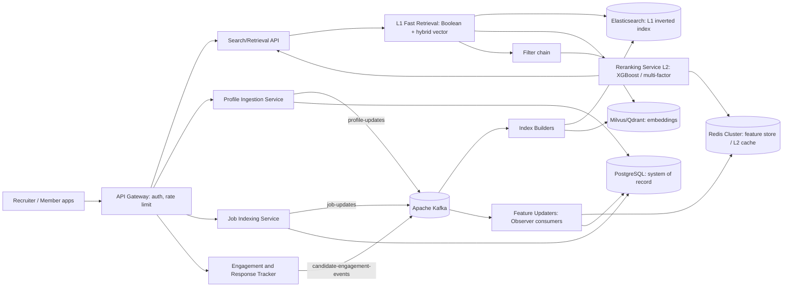
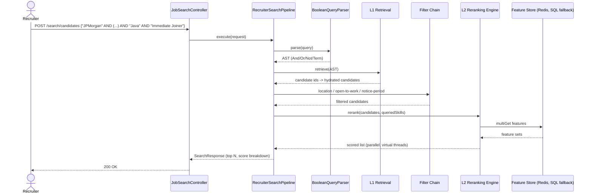
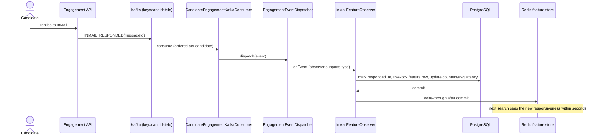
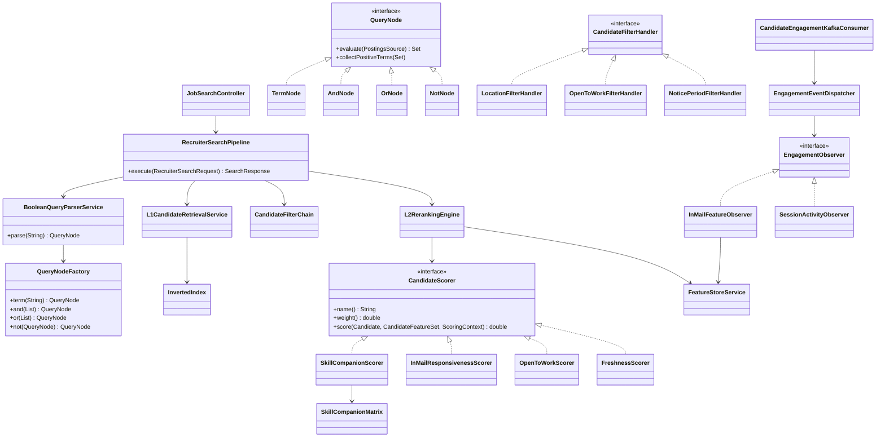

# Job Search & Recruiter Candidate Matching System: HLD and LLD

## 0. Run it
```bash
cd linkedin-job-search-engine
mvn clean test
mvn spring-boot:run          # H2 + demo data; Redis/Kafka optional (graceful degradation)
# Swagger UI: http://localhost:8080/swagger-ui.html
# No broker? run with --app.kafka.listener-enabled=false --app.kafka.publish-enabled=false
```
Try `POST /api/v1/search/candidates` with
`{"query":"\"JPMorgan\" AND (\"Talent Acquisition\" OR \"Recruiter\") AND \"Java\" AND \"Immediate Joiner\"","requiredSkills":["Java"]}`.

## 1. High-Level Design

### 1.1 Targets
100M+ members, 10M+ job posts, 50k+ QPS. Search p99 < 300 ms. Profile updates searchable in < 5 s. Availability 99.95%.

### 1.2 Architecture


### 1.3 Microservices
| Service | Responsibility | Scale axis |
|---|---|---|
| Profile Ingestion | Validate and persist profile changes, emit `profile-updates` | write QPS, partitioned by member id |
| Job Indexing | Persist job posts, build job documents/embeddings | job volume |
| Search/Retrieval API | Parse Boolean query, call L1, run filter chain, call L2, page results | read QPS (stateless, HPA) |
| Reranking Service | Batch-fetch features, score candidates in parallel, return ranked list | CPU; horizontal |
| Engagement & Response Tracker | Accept InMail sent/replied/session events, publish to Kafka | write QPS |

### 1.4 Dual-engine search
* **L1 (recall, milliseconds):** distributed inverted index (Elasticsearch in production; in-memory `InvertedIndex` in this code base) evaluating the Boolean AST over term postings; optional ANN vector retrieval fused by reciprocal-rank fusion. Output capped at ~2000 candidates.
* **L2 (precision, tens of ms):** multi-factor scoring (InMail responsiveness, Open-to-Work, skill-companion semantics, freshness/session activity). In production the linear scorer is replaced or blended with an XGBoost model served from the same feature vector.

### 1.5 Sequence: Recruiter Boolean query


### 1.6 Sequence: Real-time feedback loop


### 1.7 Storage, scalability, resilience
| Tier | Technology | Role | Scaling / HA |
|---|---|---|---|
| System of record | PostgreSQL | profiles, jobs, InMail log, features | shard by `candidate_id` hash (Citus/Vitess-style), 1 primary + 2 sync/async replicas per shard, PITR backups |
| L1 index | Elasticsearch | inverted index | shards by member-id hash, 2 replicas, rolling reindex via alias swap |
| Vectors | Milvus/Qdrant | skill/profile embeddings | HNSW, partitioned collections, replicas |
| L2 cache / features | Redis Cluster | `cfs:{id}` JSON, 10 min TTL | 16384 slots, replicas, cache-aside + write-through |

* **Caching:** feature store cache-aside with write-through on update; query-result cache keyed by normalised query + filters (30-60 s TTL) for hot recruiter searches; local Caffeine for matrix/config.
* **Rate limiting:** token bucket per recruiter and per IP at the gateway (Redis Lua), plus bulkheads on L2 executor.
* **Fault tolerance:** Redis outage trips a circuit breaker and reads fall back to SQL (implemented in `FeatureStoreService`); Kafka consumers retry with back-off then DLQ; L2 failure degrades to L1 order; index rebuild endpoint; idempotent event handling by `messageId`; multi-AZ deployment, region-level active-active reads.

## 2. Low-Level Design

### 2.1 Class diagram


### 2.2 Design patterns
| Pattern | Where | Why |
|---|---|---|
| Strategy | `CandidateScorer` implementations | add/replace scoring signals without touching the engine (Open/Closed) |
| Chain of Responsibility | `CandidateFilterHandler` + `CandidateFilterChain` (ordered by `@Order`) | composable L1 -> L2 filters |
| Factory | `QueryNodeFactory` | one place to normalise terms and flatten AND/OR nodes |
| Observer | `EngagementObserver` + `EngagementEventDispatcher` | new consumers of engagement events without changing the Kafka consumer |
| Composite | `QueryNode` tree | uniform evaluation of Boolean expressions |

### 2.3 L1 Boolean evaluation
Grammar (NOT > AND > OR, adjacent operands implicitly ANDed):
```
or      := and ( "OR" and )*
and     := unary ( ["AND"] unary )*
unary   := "NOT" unary | primary
primary := TERM | "(" or ")"
```
Index terms per candidate: skills, company/title/headline/location phrases and their 1-3-gram shingles, plus flag terms `immediate joiner`, `open to work`.

```
evaluate(node):
  Term(t):  postings[t]
  Or(c...): union(evaluate(ci))
  And(c...):
     P = [evaluate(ci) for ci not Not];  N = [evaluate(inner) for ci = Not(inner)]
     sort P by size ascending; result = P[0]; result ∩= P[i] (early exit when empty)
     if P empty: result = universe
     result -= each N
  Not(x):   universe - evaluate(x)
```
Complexity: O(sum of the smallest posting list sizes) for AND-heavy queries.

### 2.4 L2 scoring
$$Score = \frac{w_1 \cdot \text{SkillMatch} + w_2 \cdot \text{InMailResponseRate} + w_3 \cdot \text{OpenToWorkStatus} + w_4 \cdot \text{ProfileFreshness}}{w_1 + w_2 + w_3 + w_4}$$
Defaults: $w_1=0.40,\ w_2=0.30,\ w_3=0.20,\ w_4=0.10$ (configurable under `app.search.weights`). Each signal is in $[0,1]$, so $Score \in [0,1]$.

* **InMailResponseRate** = $0.8 \cdot \frac{r + 5 \cdot 0.3}{n + 5} + 0.2 \cdot e^{-\bar{h}/48}$ ($r$ replies, $n$ InMails received, $\bar{h}$ mean reply hours; Bayesian prior 0.3 stops tiny samples from dominating; speed term is 0.5 when there are no replies).
* **OpenToWorkStatus** = 1.0 (open + immediate joiner), 0.8 (open), 0.1 (not open).
* **ProfileFreshness** = $0.4 \cdot 2^{-d_{update}/90} + 0.3 \cdot 2^{-d_{active}/14} + 0.3 \cdot \min(1, s/10)$ where $s$ is the decayed session-activity score (nightly decay x 6/7).
* **SkillMatch**: see below.

```
rerank(candidates, ctx):
  features = featureStore.getBatch(ids)           # one Redis MGET, SQL for misses
  parallel for each candidate (virtual threads):
     breakdown[s.name] = clamp(s.score(c, features[c], ctx), 0, 1) for each scorer s
     total = sum(s.weight * breakdown[s.name]) / sum(s.weight)
  sort by total desc, tie-break by id
```

### 2.5 Semantic skill companion matrix
`SkillCompanionMatrix` stores symmetric affinities $A[a][b] \in [0,1]$ (for example Java-Spring Boot 0.90, Spring Boot-Microservices 0.85, Microservices-Rate Limiting 0.60). Queried skills $Q$ come from the request's `requiredSkills` plus positive query terms that are known skills.
$$\text{SkillMatch} = \frac{1}{|Q|}\sum_{q \in Q}\begin{cases}1 & q \in S_c\\ \delta \cdot \max_{h \in S_c} A[q][h] & \text{otherwise}\end{cases}$$
with $S_c$ the candidate's skills and $\delta = 0.8$ (`companion-discount`). A candidate with `Spring Boot` but not `Java` therefore earns 0.72 for `Java`, while one with an unrelated stack earns 0. In production the matrix is learned offline (skill co-occurrence / embedding cosine) and loaded from the feature platform.

## 3. Database schema (PostgreSQL DDL)
```sql
CREATE TABLE candidates (
    id                 BIGSERIAL PRIMARY KEY,
    full_name          VARCHAR(255) NOT NULL,
    headline           VARCHAR(500),
    current_company    VARCHAR(255),
    current_title      VARCHAR(255),
    location           VARCHAR(255),
    open_to_work       BOOLEAN NOT NULL DEFAULT FALSE,
    immediate_joiner   BOOLEAN NOT NULL DEFAULT FALSE,
    notice_period_days INT,
    last_active_at     TIMESTAMPTZ,
    profile_updated_at TIMESTAMPTZ
);
CREATE INDEX idx_candidates_company  ON candidates (current_company);
CREATE INDEX idx_candidates_location ON candidates (location);

CREATE TABLE candidate_skills (
    candidate_id BIGINT       NOT NULL REFERENCES candidates (id) ON DELETE CASCADE,
    skill        VARCHAR(255) NOT NULL,
    PRIMARY KEY (candidate_id, skill)
);

CREATE TABLE job_postings (
    id                   BIGSERIAL PRIMARY KEY,
    title                VARCHAR(255) NOT NULL,
    company              VARCHAR(255) NOT NULL,
    location             VARCHAR(255),
    description          VARCHAR(4000),
    min_experience_years INT,
    recruiter_id         BIGINT,
    posted_at            TIMESTAMPTZ,
    active               BOOLEAN NOT NULL DEFAULT TRUE
);

CREATE TABLE job_required_skills (
    job_id BIGINT       NOT NULL REFERENCES job_postings (id) ON DELETE CASCADE,
    skill  VARCHAR(255) NOT NULL,
    PRIMARY KEY (job_id, skill)
);

CREATE TABLE recruiter_searches (
    id           BIGSERIAL PRIMARY KEY,
    recruiter_id BIGINT,
    raw_query    VARCHAR(2000) NOT NULL,
    result_count INT NOT NULL,
    took_ms      BIGINT NOT NULL,
    created_at   TIMESTAMPTZ NOT NULL
);

CREATE TABLE inmail_communications (
    id           BIGSERIAL PRIMARY KEY,
    message_id   VARCHAR(255) NOT NULL UNIQUE,
    candidate_id BIGINT NOT NULL,
    recruiter_id BIGINT,
    sent_at      TIMESTAMPTZ NOT NULL,
    responded_at TIMESTAMPTZ
);
CREATE INDEX idx_inmail_candidate ON inmail_communications (candidate_id);
CREATE INDEX idx_inmail_recruiter ON inmail_communications (recruiter_id);

CREATE TABLE candidate_feature_scores (
    candidate_id       BIGINT PRIMARY KEY,
    inmails_received   INT NOT NULL DEFAULT 0,
    inmails_responded  INT NOT NULL DEFAULT 0,
    avg_response_hours DOUBLE PRECISION NOT NULL DEFAULT 0,
    session_activity   DOUBLE PRECISION NOT NULL DEFAULT 0,
    updated_at         TIMESTAMPTZ
);
```
